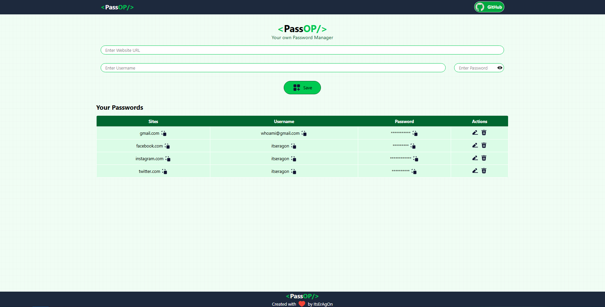

# 🔐 PassOP - Your Own Password Manager

PassOP is a secure and simple password manager built using the MERN stack. It allows users to store, view, copy, edit, and delete their website credentials efficiently.

## 🚀 Features
- Add Website URL, Username, and Password
- Copy site URL, username, or password with one click
- Edit or Delete credentials easily
- Clean and minimal UI
- MongoDB integration for secure data storage

## 🛠️ Tech Stack
- **Frontend**: React (Vite) + Tailwind CSS
- **Backend**: Node.js + Express.js
- **Database**: MongoDB

## 📸 Screenshot
 

